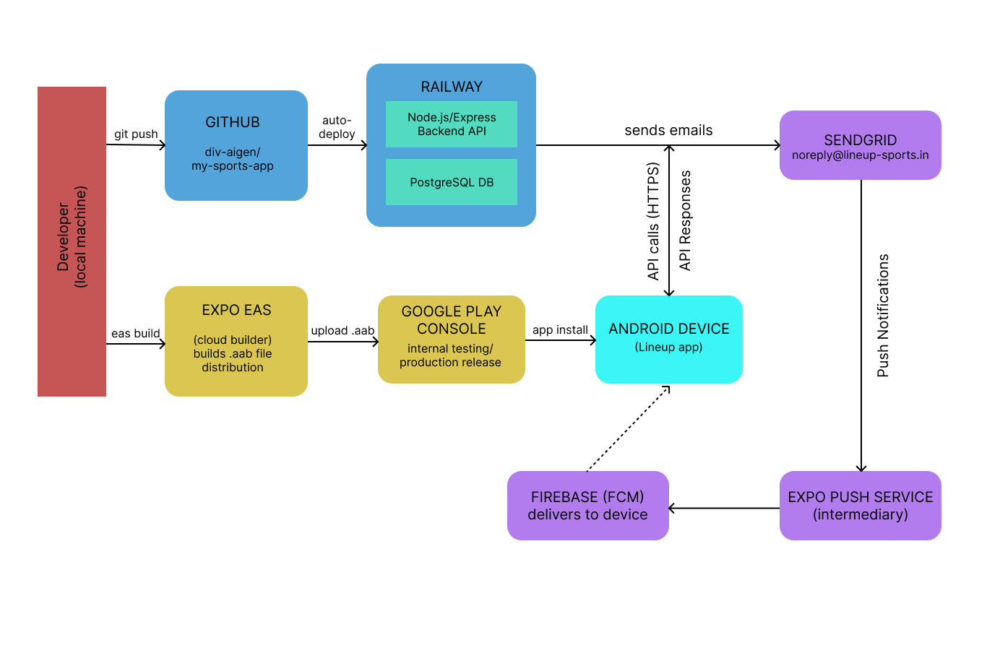

# Lineup — Sports Session Management App

Find and join local sports sessions, split costs, and play with your squad.



## Live

| Platform | URL |
|---|---|
| Web | [www.lineup-sports.in](https://www.lineup-sports.in) |
| Android | Google Play (Internal Testing) |
| Backend | Railway (Node.js + PostgreSQL) |

## Project Structure

```
Football App/
├── backend/    # Node.js + Express API
├── web/        # React web app (Vite) → Vercel
├── mobile/     # React Native app (Expo) → Google Play
└── README.md
```

## Tech Stack

| Layer | Tech |
|---|---|
| Backend | Node.js, Express, PostgreSQL, Socket.io, JWT |
| Web | React 18, Vite, Axios, Context API |
| Mobile | React Native, Expo, expo-router, AsyncStorage |
| Email | SendGrid (noreply@lineup-sports.in) |
| Push Notifications | Expo Push + Firebase (FCM) |

## Features

- Browse and join open sports sessions by sport, location, and date
- Create sessions with automatic equal cost splitting among participants
- Invite friends via shareable link or invite code
- Push notifications for session updates (full, cancelled)
- Email verification on signup, password reset via email
- Dark mode support (mobile)
- Account deletion with full data removal

## Services

See architecture diagram above. Key services:
- **Namecheap** — DNS for lineup-sports.in
- **Vercel** — Web frontend hosting
- **Railway** — Backend API + PostgreSQL database
- **SendGrid** — Transactional email
- **Zoho Mail** — support@lineup-sports.in
- **Expo EAS** — Android AAB builds
- **Google Play Console** — App distribution

## Local Development

### Backend
```bash
cd backend && npm install && npm run dev
# Runs on http://localhost:5000
```

`.env` required:
```
DATABASE_URL=postgresql://localhost:5432/football_app
JWT_SECRET=your_secret
EMAIL_USER=...
EMAIL_APP_PASSWORD=...
```

### Web
```bash
cd web && npm install && npm run dev
# Runs on http://localhost:5173
```

`.env` required:
```
VITE_API_URL=http://localhost:5000/api
```

### Mobile
```bash
cd mobile && npm install && npx expo start
```

## Deployment

- **Backend**: Auto-deploys to Railway on `git push main`
- **Web**: `npx vercel --prod` in `/web`
- **Mobile**: `eas build --platform android --profile production` → upload to Play Console

## Support

[support@lineup-sports.in](mailto:support@lineup-sports.in)